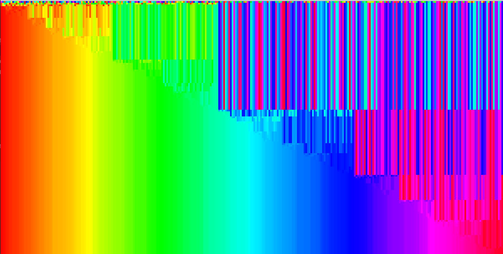
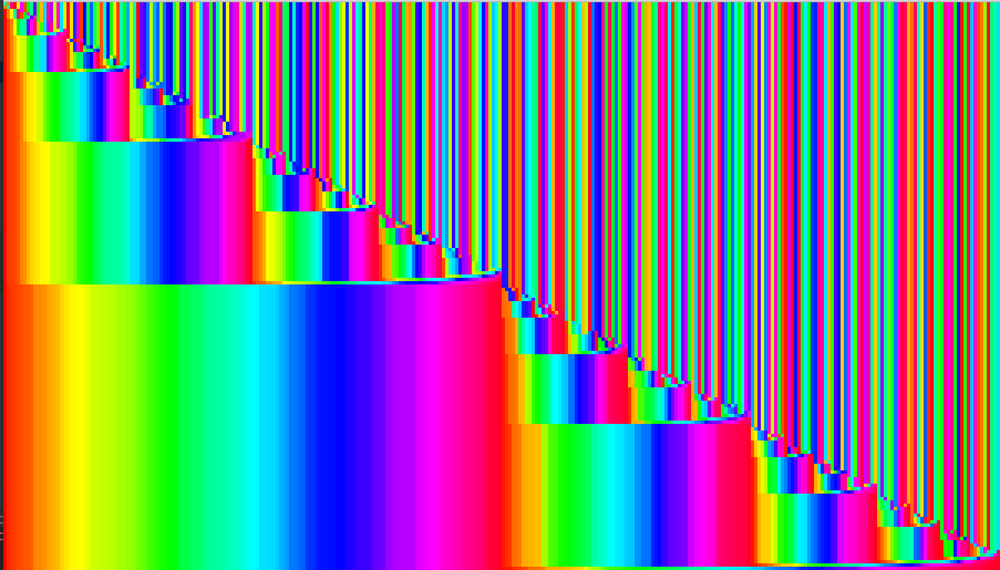

**Overview**

Colorful perspectives of sorting algorithms. 

A sorted list is represented by smooth transitions across the visible color spectrum. When a list is unsorted, it instead looks like a random assortment of colors. 

**Quicksort**

**Merge Sort**

